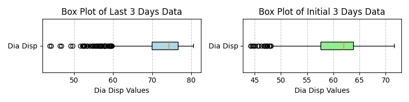
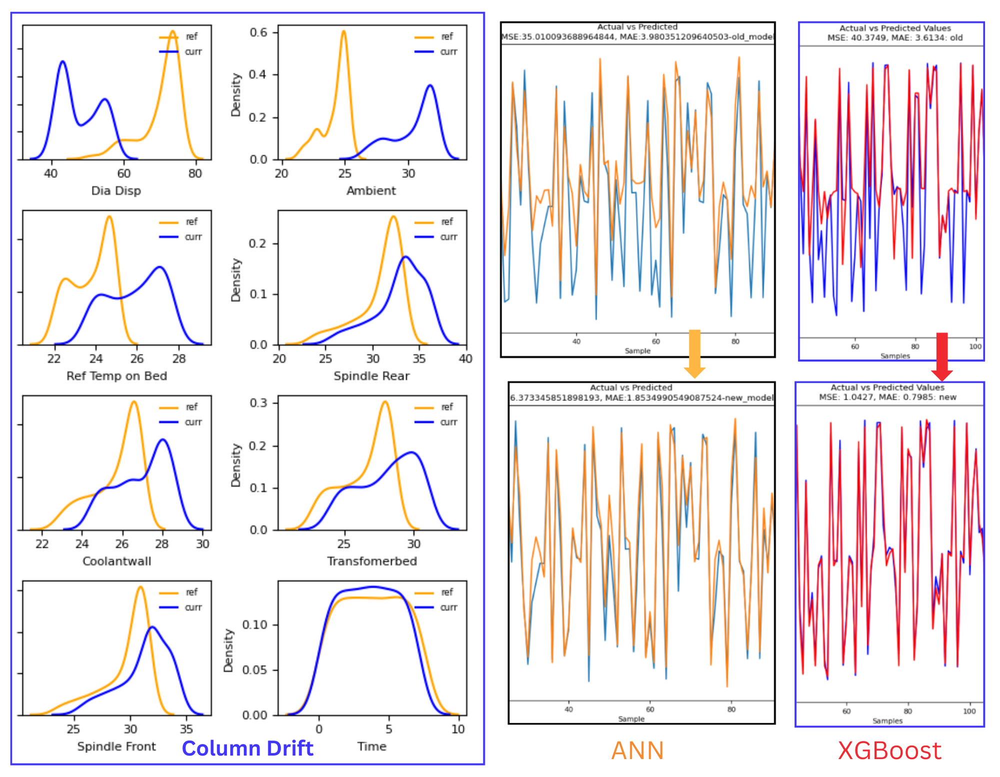
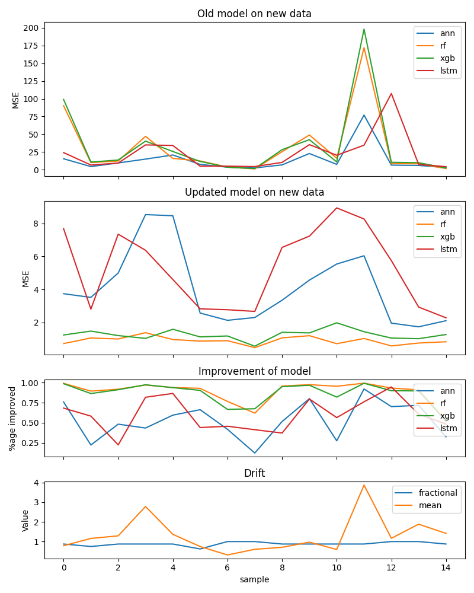

https://docs.evidentlyai.com/user-guide/customization/options-for-statistical-tests

<p align="center">
    
</p>
<p align="center"><h1 align="center">CML_THERMAL</h1></p>
<p align="center">
</p>
<p align="center">
	
	
	
	
</p>
<p align="center"><!-- default option, no dependency badges. -->
</p>
<p align="center">
	<!-- default option, no dependency badges. -->
</p>
<br>

## 🔗 Table of Contents

- [📍 Overview](#-overview)
- [👾 Features](#-features)
- [📁 Project Structure](#-project-structure)
  - [📂 Project Index](#-project-index)
- [🚀 Getting Started](#-getting-started)
  - [☑️ Prerequisites](#-prerequisites)
  - [⚙️ Installation](#-installation)
  - [🤖 Usage](#🤖-usage)
  - [🧪 Testing](#🧪-testing)
- [📌 Project Roadmap](#-project-roadmap)
- [🔰 Contributing](#-contributing)
- [🎗 License](#-license)
- [🙌 Acknowledgments](#-acknowledgments)

---

## 📍 Overview

### Machine Learning Model Testing for Continuous Improvement

This project focuses on evaluating the efficiency of various machine learning models for continuous improvement, particularly in handling new data and detecting data drift. By systematically testing multiple models, we aimed to identify their strengths under different variations of data drift and ensure robust performance over time.

### Objectives

1. **Evaluate Model Efficiency**: Test the performance of different machine learning models to handle data drift effectively.
2. **Continuous Improvement**: Monitor and improve model accuracy and adaptability with new incoming data.
3. **Drift Analysis**: Analyze the models' behavior under varying degrees of data drift in real-world scenarios.

### Dataset

- **Source**: Daily operational data from a Milling center in a Mechanical Workshop.
- **Features**: The dataset includes temperature at several critical components in machine and Diameter deviation of tool.

### Tested Models

1. **Artificial Neural Network (ANN)**
2. **Long Short-Term Memory (LSTM)**
3. **XGBoost**
4. **Random Forest**

- **Continuous Monitoring**: By monitoring the models' performance daily for 17 days, we identified patterns and optimized each model's upgrading conditions.


---

## 👾 Features
### python3 main.py - Automated Data Processing and Model Evaluation

This script automates the process of extracting and pre-processing data from Excel sheets, evaluating model drift, and performing model evaluation and retraining.

### Process Flow

1. **Data Extraction and Saving:**
   - All sheets within the Excel file are extracted and saved as individual CSV files in the `excelFile` folder.

2. **Data Preprocessing (Iterative per CSV):**
   - Each CSV file is moved from `excelFile` to the `data` folder.
   - Within the `data` folder:
      - Concatenation of the CSV file with two previous files (window size of 3) is performed.
      - 3D data is created suitable for LSTM models using the defined window size.
      - The processed data is split into training and test sets with an 80/20 ratio.
      - The processed data is saved in the `temp` folder.

3. **Model Drift Evaluation (Optional):**
   - The [`evidently`](https://docs.evidentlyai.com/user-guide/customization/options-for-statistical-tests) library is used to assess model drift with KL divergence.
     - If more than 50% of columns exhibit drift, proceed to model evaluation and retraining.
     - If not, the script loops back to step 1 to process the next sheet (data version).

4. **Model Evaluation and Retraining (Iterative per Model):**
   - Each pre-trained machine learning model is loaded.
   - Model evaluation is performed on the test data from the `temp` folder.
   - The model is then retrained on the training data from the `temp` folder.
   - Following retraining, evaluation is conducted again on the test data.
   - Mean Squared Error (MSE) is tracked for each model.

5. **MSE Results Saving:**
   - Upon successful execution of evaluation and retraining:
      - The MSE value before retraining (old model MSE) is saved in a separate CSV file.
      - The MSE value after retraining is saved in another separate CSV file.
      - Both CSV files are stored in the `report` folder.

6. **Iteration and Completion:**
   - The script iterates through this process for all sheets in the Excel file.
   - Each sheet (data version) is moved from `excelFile` to `data` for processing until all sheets have been processed.

**Note:**

- Each evaluation generates a graph stored in the `metric` folder.
- These graphs are erased when the script is run again.

### Additional Considerations

This markdown assumes the following directory structure:

---

## 📁 Project Structure

```sh
└── CML_thermal/
    ├── .github
    │   └── workflows
    ├── README.md
    ├── __init__.py
    ├── application.py
    ├── data.dvc
    ├── excel_csv
    │   └── ACE_data.xlsx
    ├── final_model.py
    ├── main.py
    ├── models
    │   ├── ann.py
    │   ├── ann_model.keras
    │   ├── lstm.py
    │   ├── lstm_model.keras
    │   ├── random_forest.py
    │   ├── rf_model.pkl
    │   ├── xgb.py
    │   └── xgboost_model.pkl
    ├── report
    │   ├── drift.csv
    │   ├── new_model_performance.csv
    │   └── old_model_performance.csv
    ├── requirements.txt
    ├── train.py
    └── utils
        ├── check_drift.py
        ├── load_data.py
        ├── make_report.py
        ├── overall_report.py
        ├── preprocess_data.py
        ├── reset.py
        └── segregated_excel.py
```


### 📂 Project Index
<details open>
	<summary><b><code>CML_THERMAL/</code></b></summary>
	<details open> <!-- __root__ Submodule -->
		<summary><b>__root__</b></summary>
		<blockquote>
			<table>
			<tr>
				<td><b><a href='https://github.com/continuous-deploy/CML_thermal/blob/master/application.py'>application.py</a></b></td>
				<td>Currently its empty. But in Deployment It contains the one model whose performance will be tested</td>
			</tr>
			<tr>
				<td><b><a href='https://github.com/continuous-deploy/CML_thermal/blob/master/data.dvc'>data.dvc</a></b></td>
				<td>It tracks the version of data where the remote has been setup. </td>
			</tr>
			<tr>
				<td><b><a href='https://github.com/continuous-deploy/CML_thermal/blob/master/main.py'>main.py</a></b></td>
				<td>It imports the modeules and sequences them to run the test on latest version of data</td>
			</tr>
			<tr>
				<td><b><a href='https://github.com/continuous-deploy/CML_thermal/blob/master/requirements.txt'>requirements.txt</a></b></td>
				<td>It contains list of packages used in the project. It is compulsary to install in working environment</td>
			</tr>
			<tr>
				<td><b><a href='https://github.com/continuous-deploy/CML_thermal/blob/master/train.py'>train.py</a></b></td>
				<td>It imports the ML models from models package, create object of it. Runs the model evaluation and upgradation when called by main.</td>
			</tr>
			</table>
		</blockquote>
	</details>
	<details> <!-- .github Submodule -->
		<summary><b>.github</b></summary>
		<blockquote>
			<details>
				<summary><b>workflows</b></summary>
				<blockquote>
					<table>
					<tr>
						<td><b><a href='https://github.com/continuous-deploy/CML_thermal/blob/master/.github/workflows/integration.yaml'>integration.yaml</a></b></td>
						<td>It is integration pipeline. when drift is detected, model is upgraded and integrated.</td>
					</tr>
					</table>
				</blockquote>
			</details>
		</blockquote>
	</details>
	<details> <!-- models Submodule -->
		<summary><b>models</b></summary>
		<blockquote>
			<table>
			<tr>
				<td><b><a href='https://github.com/continuous-deploy/CML_thermal/blob/master/models/ann.py'>ann.py</a></b></td>
				<td>module defining ANN model class</td>
			</tr>
			<tr>
				<td><b><a href='https://github.com/continuous-deploy/CML_thermal/blob/master/models/ann_model.keras'>ann_model.keras</a></b></td>
				<td>upgraded ANN model</td>
			</tr>
			<tr>
				<td><b><a href='https://github.com/continuous-deploy/CML_thermal/blob/master/models/random_forest.py'>random_forest.py</a></b></td>
				<td>module defining Random forest model class</td>
			</tr>
            <tr>
				<td><b><a href='https://github.com/continuous-deploy/CML_thermal/blob/master/models/rf_model.pkl'>random_forest.py</a></b></td>
				<td>Upgraded Random forest model</td>
			</tr>
			<tr>
				<td><b><a href='https://github.com/continuous-deploy/CML_thermal/blob/master/models/lstm.py'>lstm.py</a></b></td>
				<td>module defining LSTM model class</td>
			</tr>
			<tr>
				<td><b><a href='https://github.com/continuous-deploy/CML_thermal/blob/master/models/lstm_model.keras'>lstm_model.keras</a></b></td>
				<td>Upgraded LSTM model</td>
			</tr>
			<tr>
				<td><b><a href='https://github.com/continuous-deploy/CML_thermal/blob/master/models/xgb.py'>xgb.py</a></b></td>
				<td>module defining XGBoost model class</td>
			</tr>
            <tr>
				<td><b><a href='https://github.com/continuous-deploy/CML_thermal/blob/master/models/xgboost_model.pkl'>xgb.py</a></b></td>
				<td>Upgraded XGBoost model</td>
			</tr>
			</table>
		</blockquote>
	</details>
	<details> <!-- utils Submodule -->
		<summary><b>utils</b></summary>
		<blockquote>
			<table>
            <tr>
				<td><b><a href='https://github.com/continuous-deploy/CML_thermal/blob/master/utils/load_data.py'>load_data.py</a></b></td>
				<td>It loads recent data in preset window of time</td>
			</tr>
            <tr>
				<td><b><a href='https://github.com/continuous-deploy/CML_thermal/blob/master/utils/preprocess_data.py'>preprocess_data.py</a></b></td>
				<td>It has functions which perform two type of data preparation. One is for time series model. Other just conctenating. Prepared data is saved into temporary folder.</td>
			</tr>
			<tr>
				<td><b><a href='https://github.com/continuous-deploy/CML_thermal/blob/master/utils/segregated_excel.py'>segregated_excel.py</a></b></td>
				<td>This module contains function which which extracts sheets from excel file and save seperately</td>
			</tr>
			<tr>
				<td><b><a href='https://github.com/continuous-deploy/CML_thermal/blob/master/utils/check_drift.py'>check_drift.py</a></b></td>
				<td>It contains functions which plots data distribution and evaluate drift. Both functions read and write into file</td>
			</tr>
			<tr>
				<td><b><a href='https://github.com/continuous-deploy/CML_thermal/blob/master/utils/overall_report.py'>overall_report.py</a></b></td>
				<td>It generate a compiled report demonstarting performance of model on new data and how much it adopts new data after upgradation.</td>
			</tr>
			<tr>
				<td><b><a href='https://github.com/continuous-deploy/CML_thermal/blob/master/utils/reset.py'>reset.py</a></b></td>
				<td>It cleans folders and sets to initial configuration. This also alters system files.</td>
			</tr>
			<tr>
				<td><b><a href='https://github.com/continuous-deploy/CML_thermal/blob/master/utils/make_report.py'>make_report.py</a></b></td>
				<td>It makes report showing performance of model on new data and after upgrading model on new data.</td>
			</tr>
			</table>
		</blockquote>
	</details>
</details>

---
## 🚀 Getting Started

### ☑️ Prerequisites

Before getting started with CML_thermal, ensure your runtime environment meets the following requirements:

- **Programming Language:** Python
- **Package Manager:** Pip


### ⚙️ Installation

Install CML_thermal using one of the following methods:

**Build from source:**

1. Clone the CML_thermal repository:
```sh
❯ git clone https://github.com/continuous-deploy/CML_thermal
```

2. Navigate to the project directory:
```sh
❯ cd CML_thermal
```

2.5 Create environment
```sh
python3 -m venv CMLEnv
source CMLEnv/bin/activate
```
3. Install the project dependencies:


**Using `pip`** &nbsp; [](https://pypi.org/project/pip/)

```sh
❯ pip install -r requirements.txt
```


### 🤖 Usage
Run CML_thermal using the following command:

On linux
```sh
❯ python3 main.py
```
On Windows
```sh
❯ python main.py
```

<!-- ### 🧪 Testing
Run the test suite using the following command:
**Using `pip`** &nbsp; [](https://pypi.org/project/pip/)

```sh
❯ pytest
``` -->


---
## 📌 Project Roadmap

- [X] **`Task 1`**: <strike>Developing architecture for continuous learning.</strike>
- [ ] **`Task 2`**: Deploying and Testing the architecture on cloud infrastructure.
- [ ] **`Task 3`**: Deploying on Edge computer, working on Milling.

---

## 🔰 Contributing

- **💬 [Join the Discussions](https://github.com/continuous-deploy/CML_thermal/discussions)**: Share your insights, provide feedback, or ask questions.
- **🐛 [Report Issues](https://github.com/continuous-deploy/CML_thermal/issues)**: Submit bugs found or log feature requests for the `CML_thermal` project.
- **💡 [Submit Pull Requests](https://github.com/continuous-deploy/CML_thermal/blob/main/CONTRIBUTING.md)**: Review open PRs, and submit your own PRs.

<details closed>
<summary>Contributing Guidelines</summary>

1. **Fork the Repository**: Start by forking the project repository to your github account.
2. **Clone Locally**: Clone the forked repository to your local machine using a git client.
   ```sh
   git clone https://github.com/continuous-deploy/CML_thermal
   ```
3. **Create a New Branch**: Always work on a new branch, giving it a descriptive name.
   ```sh
   git checkout -b new-feature-x
   ```
4. **Make Your Changes**: Develop and test your changes locally.
5. **Commit Your Changes**: Commit with a clear message describing your updates.
   ```sh
   git commit -m 'Implemented new feature x.'
   ```
6. **Push to github**: Push the changes to your forked repository.
   ```sh
   git push origin new-feature-x
   ```
7. **Submit a Pull Request**: Create a PR against the original project repository. Clearly describe the changes and their motivations.
8. **Review**: Once your PR is reviewed and approved, it will be merged into the main branch. Congratulations on your contribution!
</details>

<details open>
<summary>Contributor Graph</summary>
<br>
<p align="left">
   <a href="https://github.com{/continuous-deploy/CML_thermal/}graphs/contributors">
      
   </a>
</p>
</details>

---

<!-- ## 🎗 License

This project is protected under the [SELECT-A-LICENSE](https://choosealicense.com/licenses) License. For more details, refer to the [LICENSE](https://choosealicense.com/licenses/) file.

--- -->

## 🙌 Result

- List any resources, contributors, inspiration, etc. here.

### Distribution of dependent value:


### Drift and Upgrading of model


### Visulisation of Performance and Improvement in model


---
